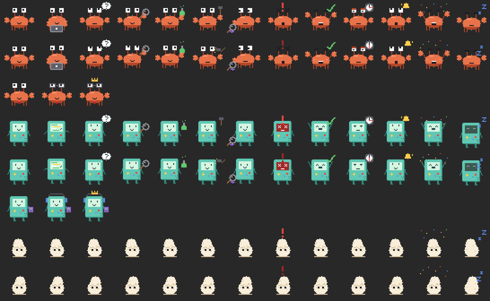

# DevPet — 智能桌寵小屏幕 (Smart Desk-Pet Status Display)

A pixel-art desk pet that mirrors what your Claude Code session is doing, in
real time. **Clawd** the crab 🦀, **Beemo** the handheld, or **Grogu** 👶 lives
on an ESP32 mini screen on your desk, in a tiny always-on-top window on your
monitor, or both — and **grows** as you work.



- **13 states**: idle, coding, thinking, searching, testing, building,
  debugging, error, success, waiting, notify, celebrating, sleep
- **3 characters** + a shared egg form, all generated from one pixel-art source
- **Live Claude Code status**: every session, the model it is running, the act
  the agent is taking right now, and token usage per session and all-time
- **Growth**: XP from real usage; Lv1 Egg → Lv2 Baby → Lv3 Junior → Lv4 Senior
  → Lv5 Legend, with the pet rendered bigger and better dressed each level
- **Runs silently** in the background on Windows, macOS and Linux
- **Two editions** — see below

## Two editions

|   | Standalone (`petd`) | Firmware (`petd-lite`) |
|---|---|---|
| Where the brain lives | your PC | the ESP32 board |
| State machine, XP, growth, memory | `pc/petd` | `firmware/src/machine.cpp`, `growth.cpp` (XP survives in NVS) |
| Dev board | optional — mirrors the pet | required |
| PC binary's job | everything | forward hook events over USB, draw what the board reports |
| Pet shown on | PC window and/or the board screen | the board screen, the PC screen, or both |
| Install needed | yes (or run the portable exe) | none beyond one portable binary |

Both editions read the same Claude Code hooks and render the same sprites, so
you can switch by launching a different binary.

```
                    standalone edition
Claude Code ─hooks─▶ pet-hook ─HTTP─▶ petd ─USB─▶ ESP32 + ST7789
                                        │          (mirrors)
                                        └──▶ desktop pet window + status panel

                    firmware edition
Claude Code ─hooks─▶ pet-hook ─HTTP─▶ petd-lite ─USB events─▶ ESP32 (the brain)
                                            ◀── status ──────┘
                                        └──▶ desktop pet window (optional mirror)
```

## Install

Grab an installer from [Releases](https://github.com/dennislee928/Claude_Devboard_Pet/releases):

| Platform | File |
|---|---|
| Windows | `DevPet-<ver>.msi` (per-user, no admin) or `DevPet-Setup-<ver>.exe` |
| macOS | `DevPet-<ver>.pkg` (installs and wires up the hooks) or `DevPet-<ver>.dmg` |
| Linux | `DevPet-<ver>-linux-x86_64.tar.gz`, then `./setup.sh` |
| Board | `DevPet-<ver>-firmware.zip`, then `flash-firmware.sh` / `.ps1` |

Every binary and installer is signed with a **self-signed** publisher
certificate (`DevPet-selfsigned.cer`, attached to each release) and carries
publisher metadata — "DevPet Project" — instead of showing up as an unknown
publisher with no identity. Self-signed is not the same as trusted: your OS
still warns on first launch unless you import that certificate into Trusted
Publishers (Windows) or your login keychain (macOS).

### From source

```bash
# 1. sprites (writes firmware/src/sprites_gen.h + pc/petd/assets + assets_gen.rs)
cargo run --release -p asset-gen --manifest-path pc/Cargo.toml

# 2. both editions
cargo build --release --manifest-path pc/Cargo.toml

# 3. install + hook up Claude Code + start in the background
./scripts/setup.sh            # macOS / Linux
.\install.ps1                 # Windows
```

Firmware:

```bash
pio run -d firmware -t upload
```

## Running silently in the background

The pet is a background process on every OS — no console window, no Dock icon,
no taskbar button.

```bash
petd --daemon                 # detach now, log to the state dir
petd --install-autostart      # and every login from now on
petd --uninstall-autostart
```

That writes an `HKCU\...\Run` value on Windows, a `LaunchAgent` plist
(`ProcessType=Background`) on macOS, and a `systemd --user` unit on Linux.
The macOS `.app` sets `LSUIElement`, so it never appears in the Dock or the
app switcher.

## Watching Claude Code

Right-click the pet → **📊 Claude status panel**. The panel is a *separate*
window docked beside the pet and repositioned whenever the pet moves, so it can
never cover it. It shows, per session:

- the project, and whether that session is working right now
- the model in use (read from the session transcript, e.g. `Opus 5`)
- the act being taken — `Editing state.rs`, `$ cargo test -p petd`,
  `Delegating to a subagent`, `Waiting for permission`
- prompts, tool calls, and input / output / cached tokens for that session
- totals across all tracked sessions and all time

The pet reacts to the same signals: it waves at a new session, thinks on a
prompt, types while editing, runs to the flask while testing, swings a hammer
on builds, goes X-eyed on an error and debugs afterwards, rings a bell when
permission is pending, celebrates on level-up — and visibly speeds up when more
than one agent is working at once.

Token counts come from the session transcript JSONL that Claude Code already
writes locally; DevPet only reads the bytes appended since its last check.

## Hardware

| Part | Detail |
|---|---|
| Board | ESP-WROOM-32 DevKit V1 (ESP32-D0WD-V3, 4MB flash, CH9102 USB) |
| Screen | ST7789 240x240 1.3"/1.54" IPS, SPI |

Wiring (DevKit V1 → screen):

| Screen pin | ESP32 pin |
|---|---|
| VCC | 3V3 |
| GND | GND |
| SCL / SCK | GPIO18 |
| SDA / MOSI | GPIO23 |
| RES | GPIO4 |
| DC | GPIO2 |
| CS | GPIO5 |
| BLK / BL | 3V3 (always on) |

> If your ST7789 module has **no CS pin**, add `-DTFT_SPI_MODE3=1` to
> `firmware/platformio.ini` build_flags and tie nothing to GPIO5.

The serial port is auto-detected by USB VID/PID on all three OSes (`COM9`,
`/dev/cu.usbserial-*`, `/dev/ttyUSB*`); override with `--port`.

## Command line

```
petd | petd-lite
  --display board|desktop|both   where the pet is shown (default both)
  --port <PORT>                  serial port override
  --char clawd|beemo|grogu       which pet
  --panel                        open the Claude Code status panel
  --panel-side auto|left|right   which side the panel docks to
  --wander                       stroll around the screen when idle
  --daemon                       detach and run silently
  --install-autostart            start silently at every login
  --uninstall-autostart          undo that
  --reset-growth                 back to Lv1 (standalone edition)
```

Settings live next to the growth state: `%APPDATA%\devpet` (Windows),
`~/Library/Application Support/devpet` (macOS), `~/.config/devpet` (Linux).

## Testing

```bash
cargo test --manifest-path pc/Cargo.toml   # state machine, sessions, hooks, board protocol
make -C firmware/test                      # the board's brain, host-compiled, no hardware
```

The firmware checks mirror the Rust ones on purpose — that is what keeps the
two editions behaving identically.

## Building the installers

```powershell
.\scripts\package-windows.ps1 -Version 0.1.0 -Sign     # zip + setup .exe + .msi
```
```bash
./scripts/package-macos.sh 0.1.0 --sign                # .app + .dmg + .pkg
./scripts/package-linux.sh 0.1.0                       # tarball
```

CI runs the same scripts: `.github/workflows/ci.yml` on every push (tests,
clippy, both editions on all three OSes, firmware build) and
`.github/workflows/release.yml` on a `v*` tag, which builds and publishes all
of the above.

## Layout

```
pc/asset-gen     pixel-art source for every sprite → PNGs + C header + Rust tables
pc/petd          shared engine + both editions (petd, petd-lite)
pc/pet-hook      tiny binary the Claude Code hooks invoke
pc/setup-stub    self-extracting Windows installer
firmware/src     ESP32 firmware; machine.cpp + growth.cpp are the board's brain
firmware/test    host-compiled tests for that brain
packaging/wix    MSI definition
scripts          build, package, sign, install, uninstall (all OSes)
```

## License

MIT.
